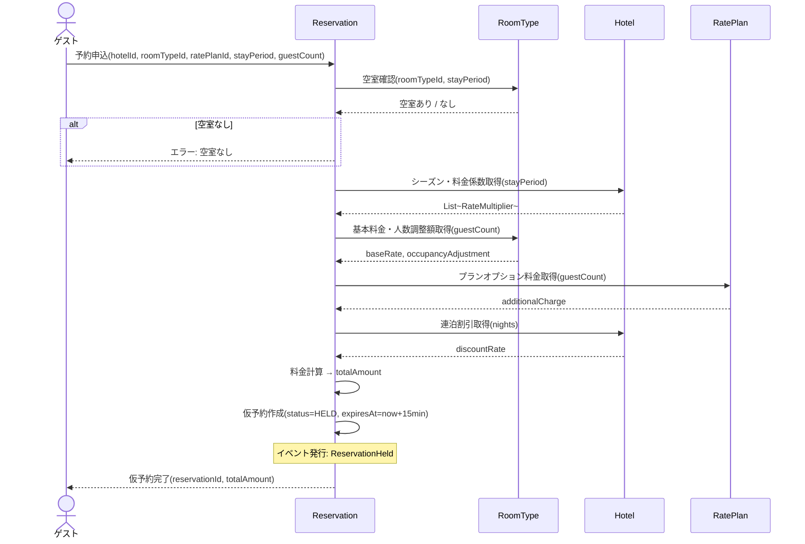

# DE-01: 仮予約作成 (ReservationHeld)

## 概要
ゲストが予約を申し込み、空室確認が通った時点で発行される。在庫を一時確保し、決済へ遷移する。

## イベントペイロード
| フィールド | 型 | 説明 |
|-----------|---|------|
| reservationId | ReservationId | 予約ID |
| hotelId | HotelId | 対象ホテル |
| guestId | GuestId | ゲストID |
| roomTypeId | RoomTypeId | 部屋タイプ |
| ratePlanId | RatePlanId | 料金プラン |
| stayPeriod | StayPeriod | 宿泊期間 |
| guestCount | GuestCount | 人数構成 |
| totalAmount | Money | 仮算出した合計金額 |
| expiresAt | DateTime | 仮予約の有効期限 |

## 詳細フロー

## 後続処理
| 処理 | 担当 | 説明 |
|------|------|------|
| TTLタイマー開始 | アプリケーションサービス | 15分後に失効チェックをスケジュール |
| 決済画面への遷移 | UI | ゲストに決済情報入力を促す |

## 関連イベント
- → [DE-02: 仮予約失効](./DE-02_reservation-expired.md) — TTL超過時に発行
- → [DE-09: 決済完了](./DE-09_payment-completed.md) — 決済成功時に発行
- → [DE-10: 決済失敗](./DE-10_payment-failed.md) — 決済失敗時に発行
