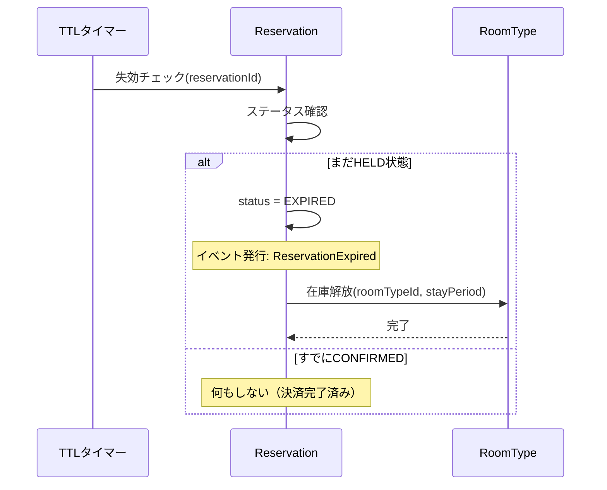

# DE-02: 仮予約失効 (ReservationExpired)

## 概要
仮予約のTTL（15分）を超過した場合に発行される。一時確保していた在庫を解放する。

## イベントペイロード
| フィールド | 型 | 説明 |
|-----------|---|------|
| reservationId | ReservationId | 予約ID |
| hotelId | HotelId | 対象ホテル |
| roomTypeId | RoomTypeId | 部屋タイプ |
| stayPeriod | StayPeriod | 宿泊期間 |

## 詳細フロー

## 後続処理
| 処理 | 担当 | 説明 |
|------|------|------|
| 在庫解放 | RoomType | 一時確保していた在庫を戻す |

## 関連イベント
- ← [DE-01: 仮予約作成](./DE-01_reservation-held.md) — TTLタイマーの起点
- ← [DE-10: 決済失敗](./DE-10_payment-failed.md) — 決済失敗により即座に失効する場合
