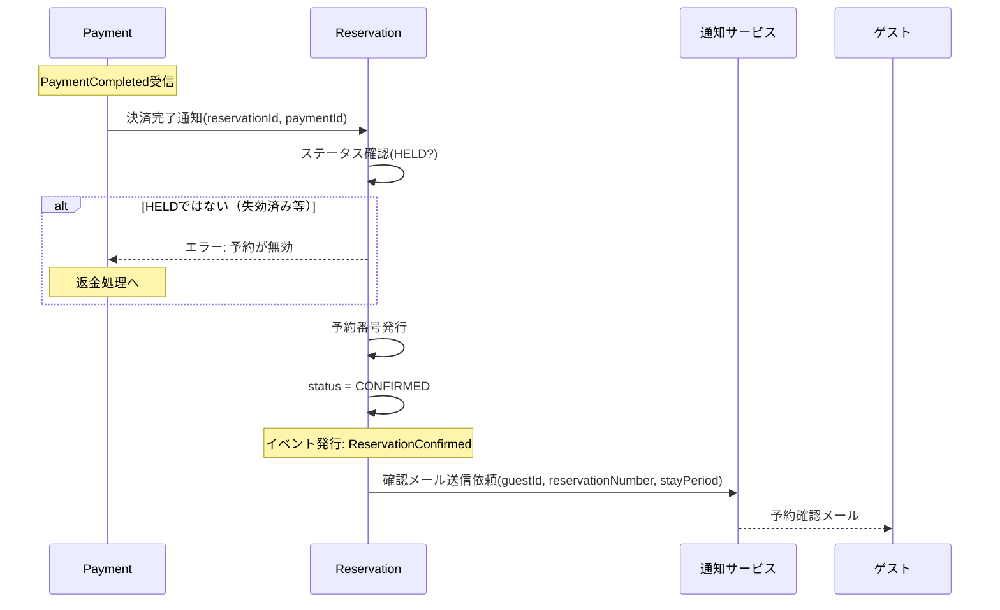

# DE-03: 予約確定 (ReservationConfirmed)

## 概要
決済が完了し、予約が正式に確定した時点で発行される。予約番号を発行し、確認通知を送信する。

## イベントペイロード
| フィールド | 型 | 説明 |
|-----------|---|------|
| reservationId | ReservationId | 予約ID |
| reservationNumber | ReservationNumber | 発行された予約番号 |
| hotelId | HotelId | 対象ホテル |
| guestId | GuestId | ゲストID |
| stayPeriod | StayPeriod | 宿泊期間 |
| totalAmount | Money | 確定した合計金額 |
| paymentId | PaymentId | 決済ID |

## 詳細フロー

## 後続処理
| 処理 | 担当 | 説明 |
|------|------|------|
| 予約番号発行 | Reservation | 一意の予約番号を生成・付与 |
| 確認メール送信 | 通知サービス | ゲストへ予約確定の通知 |
| 在庫の確定反映 | RoomType | 一時確保 → 確定に切り替え |

## 関連イベント
- ← [DE-09: 決済完了](./DE-09_payment-completed.md) — 決済完了が本イベントのトリガー
- → [DE-04: 予約変更](./DE-04_reservation-modified.md) — 確定後に変更が可能
- → [DE-05: 予約キャンセル](./DE-05_reservation-cancelled.md) — 確定後にキャンセルが可能
- → [DE-06: チェックイン](./DE-06_guest-checked-in.md) — 確定済み予約のチェックイン
- → [DE-08: ノーショー検出](./DE-08_no-show-detected.md) — 確定済みだがチェックインされなかった場合
