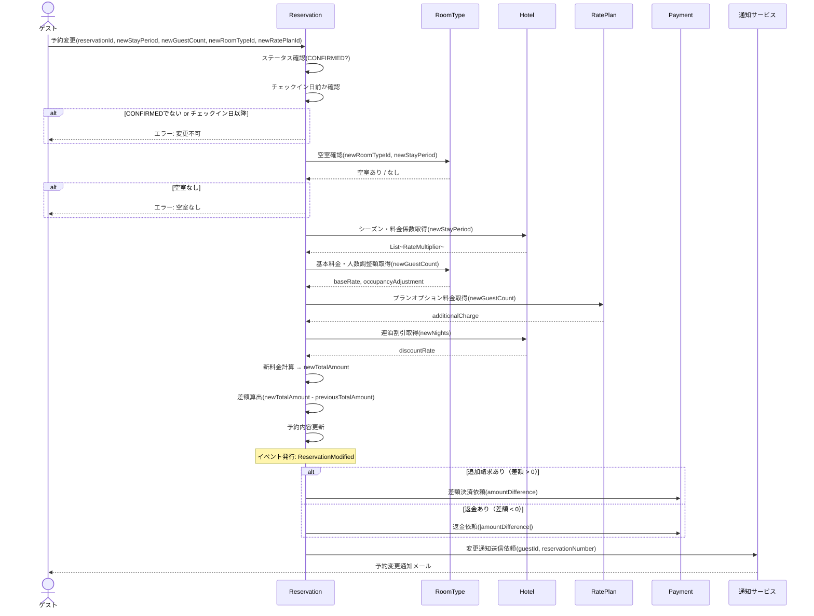

# DE-04: 予約変更 (ReservationModified)

## 概要
確定済みの予約に対して、日程・部屋タイプ・人数・プランの変更が行われた時点で発行される。

## イベントペイロード
| フィールド | 型 | 説明 |
|-----------|---|------|
| reservationId | ReservationId | 予約ID |
| reservationNumber | ReservationNumber | 予約番号 |
| hotelId | HotelId | 対象ホテル |
| guestId | GuestId | ゲストID |
| previousStayPeriod | StayPeriod | 変更前の宿泊期間 |
| newStayPeriod | StayPeriod | 変更後の宿泊期間 |
| previousTotalAmount | Money | 変更前の合計金額 |
| newTotalAmount | Money | 変更後の合計金額 |
| amountDifference | Money | 差額（正:追加請求, 負:返金） |

## 詳細フロー

## 後続処理
| 処理 | 担当 | 説明 |
|------|------|------|
| 料金再計算 | Reservation | 変更後の内容で料金を再算出 |
| 差額決済 or 返金 | Payment | 差額がある場合に追加請求または返金 |
| 在庫調整 | RoomType | 旧期間の在庫解放 + 新期間の在庫確保 |
| 変更通知送信 | 通知サービス | ゲストへ変更完了の通知 |

## 関連イベント
- ← [DE-03: 予約確定](./DE-03_reservation-confirmed.md) — 確定済みの予約が変更対象
- → [DE-09: 決済完了](./DE-09_payment-completed.md) — 差額の追加決済が発生する場合
