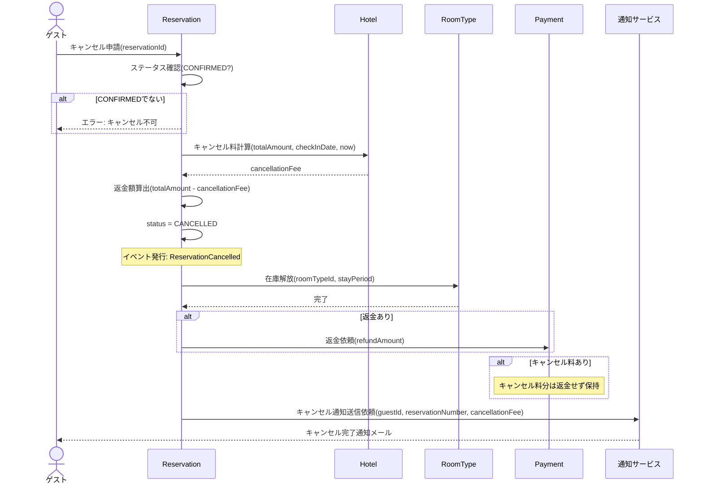

# DE-05: 予約キャンセル (ReservationCancelled)

## 概要
確定済みの予約がゲストによりキャンセルされた時点で発行される。キャンセルポリシーに基づきキャンセル料を算出する。

## イベントペイロード
| フィールド | 型 | 説明 |
|-----------|---|------|
| reservationId | ReservationId | 予約ID |
| reservationNumber | ReservationNumber | 予約番号 |
| hotelId | HotelId | 対象ホテル |
| guestId | GuestId | ゲストID |
| cancellationFee | Money | キャンセル料 |
| refundAmount | Money | 返金額（支払済み金額 - キャンセル料） |

## 詳細フロー

## 後続処理
| 処理 | 担当 | 説明 |
|------|------|------|
| キャンセル料計算 | Hotel (CancellationPolicy) | チェックイン日との日数差に基づき料金算出 |
| 在庫解放 | RoomType | 確保していた在庫を戻す |
| 返金処理 | Payment | 支払済み金額 - キャンセル料を返金 |
| キャンセル通知送信 | 通知サービス | ゲストへキャンセル完了とキャンセル料の通知 |

## 関連イベント
- ← [DE-03: 予約確定](./DE-03_reservation-confirmed.md) — 確定済みの予約がキャンセル対象
