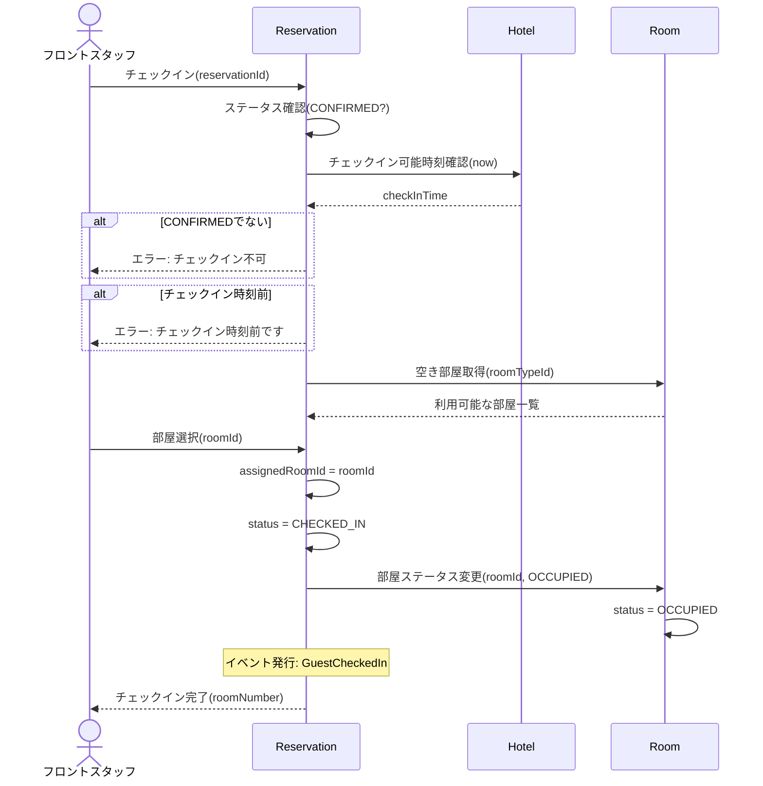

# DE-06: チェックイン (GuestCheckedIn)

## 概要
フロントでゲストがチェックイン処理を行い、具体的な部屋が割り当てられた時点で発行される。

## イベントペイロード
| フィールド | 型 | 説明 |
|-----------|---|------|
| reservationId | ReservationId | 予約ID |
| reservationNumber | ReservationNumber | 予約番号 |
| hotelId | HotelId | 対象ホテル |
| guestId | GuestId | ゲストID |
| roomId | RoomId | 割り当てられた部屋 |
| roomNumber | RoomNumber | 部屋番号 |
| checkedInAt | DateTime | チェックイン日時 |

## 詳細フロー

## 後続処理
| 処理 | 担当 | 説明 |
|------|------|------|
| 部屋割当 | Reservation | 予約に具体的なRoomIdを紐付け |
| 部屋ステータス変更 | Room | AVAILABLE → OCCUPIED |

## 関連イベント
- ← [DE-03: 予約確定](./DE-03_reservation-confirmed.md) — 確定済み予約がチェックイン対象
- → [DE-07: チェックアウト](./DE-07_guest-checked-out.md) — チェックイン後にチェックアウト可能
