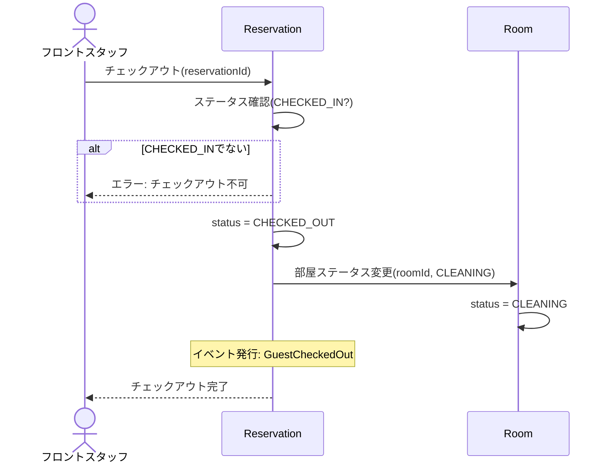

# DE-07: チェックアウト (GuestCheckedOut)

## 概要
ゲストがチェックアウト処理を行い、部屋が解放された時点で発行される。

## イベントペイロード
| フィールド | 型 | 説明 |
|-----------|---|------|
| reservationId | ReservationId | 予約ID |
| reservationNumber | ReservationNumber | 予約番号 |
| hotelId | HotelId | 対象ホテル |
| guestId | GuestId | ゲストID |
| roomId | RoomId | チェックアウトする部屋 |
| checkedOutAt | DateTime | チェックアウト日時 |

## 詳細フロー

## 後続処理
| 処理 | 担当 | 説明 |
|------|------|------|
| 部屋ステータス変更 | Room | OCCUPIED → CLEANING |
| 清掃完了後 | Room | CLEANING → AVAILABLE（清掃スタッフが操作。本イベントのスコープ外） |

## 関連イベント
- ← [DE-06: チェックイン](./DE-06_guest-checked-in.md) — チェックイン済みの予約がチェックアウト対象
- → [DE-11: 部屋ステータス変更](./DE-11_room-status-changed.md) — OCCUPIED→CLEANINGへ遷移後、清掃完了でAVAILABLEへ
