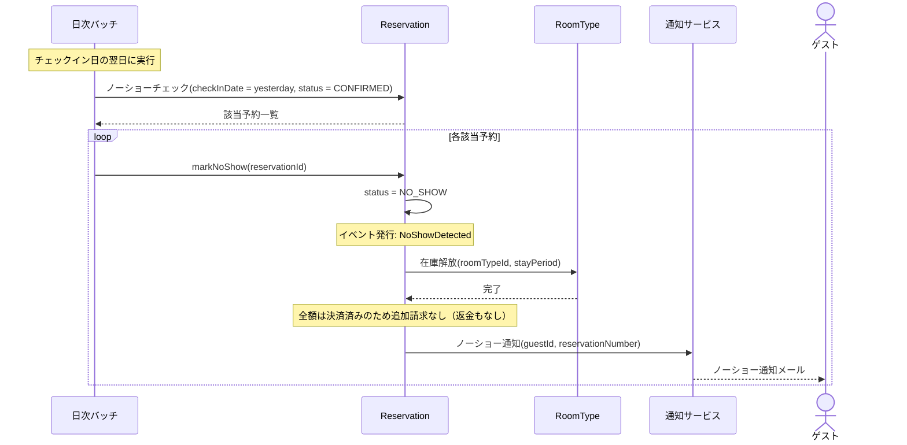

# DE-08: ノーショー検出 (NoShowDetected)

## 概要
チェックイン日の翌日になってもチェックインがなかった場合に発行される。宿泊料金の全額を請求する。

## イベントペイロード
| フィールド | 型 | 説明 |
|-----------|---|------|
| reservationId | ReservationId | 予約ID |
| reservationNumber | ReservationNumber | 予約番号 |
| hotelId | HotelId | 対象ホテル |
| guestId | GuestId | ゲストID |
| totalAmount | Money | 全額請求金額 |
| detectedAt | DateTime | 検出日時 |

## 詳細フロー

## 後続処理
| 処理 | 担当 | 説明 |
|------|------|------|
| ステータス変更 | Reservation | CONFIRMED → NO_SHOW |
| 在庫解放 | RoomType | 確保していた在庫を戻す |
| 全額請求 | — | 予約確定時に決済済みのため追加処理なし（返金しない） |
| ノーショー通知 | 通知サービス | ゲストへノーショー扱いの通知 |

## 関連イベント
- ← [DE-03: 予約確定](./DE-03_reservation-confirmed.md) — 確定済みだがチェックインされなかった予約が対象
