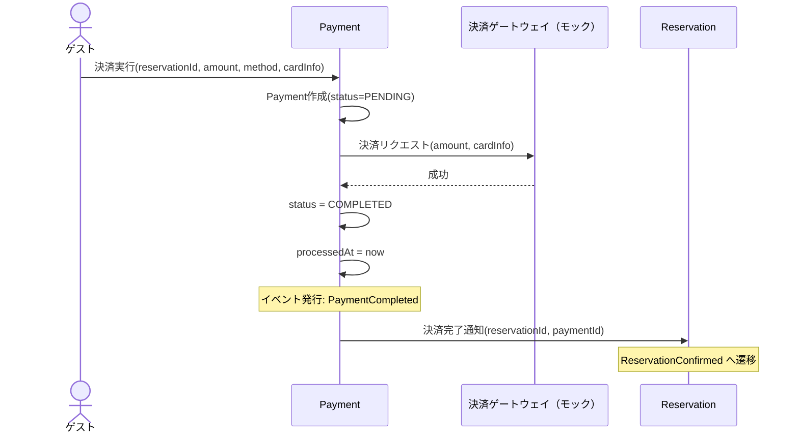

# DE-09: 決済完了 (PaymentCompleted)

## 概要
決済処理が成功した時点で発行される。予約の確定遷移をトリガーする。

## イベントペイロード
| フィールド | 型 | 説明 |
|-----------|---|------|
| paymentId | PaymentId | 決済ID |
| reservationId | ReservationId | 対象予約ID |
| amount | Money | 決済金額 |
| method | PaymentMethod | 決済手段 |
| processedAt | DateTime | 決済処理日時 |

## 詳細フロー

## 後続処理
| 処理 | 担当 | 説明 |
|------|------|------|
| 予約確定 | Reservation | HELD → CONFIRMED への遷移トリガー |

## 関連イベント
- ← [DE-01: 仮予約作成](./DE-01_reservation-held.md) — 仮予約後に決済が実行される
- → [DE-03: 予約確定](./DE-03_reservation-confirmed.md) — 決済完了が予約確定をトリガー
