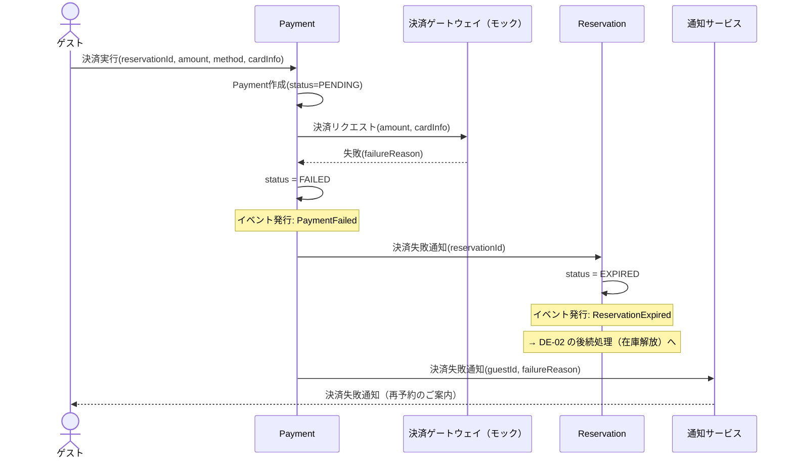

# DE-10: 決済失敗 (PaymentFailed)

## 概要
決済処理が失敗した時点で発行される。仮予約の失効をトリガーする。

## イベントペイロード
| フィールド | 型 | 説明 |
|-----------|---|------|
| paymentId | PaymentId | 決済ID |
| reservationId | ReservationId | 対象予約ID |
| amount | Money | 決済試行金額 |
| failureReason | String | 失敗理由 |
| failedAt | DateTime | 失敗日時 |

## 詳細フロー

## 後続処理
| 処理 | 担当 | 説明 |
|------|------|------|
| 仮予約失効 | Reservation | HELD → EXPIRED への遷移トリガー |
| 在庫解放 | RoomType | [DE-02](./DE-02_reservation-expired.md)の後続処理として実行 |
| 失敗通知 | 通知サービス | ゲストへ決済失敗の通知と再予約案内 |

## 関連イベント
- ← [DE-01: 仮予約作成](./DE-01_reservation-held.md) — 仮予約後に決済が実行される
- → [DE-02: 仮予約失効](./DE-02_reservation-expired.md) — 決済失敗が仮予約失効をトリガー
