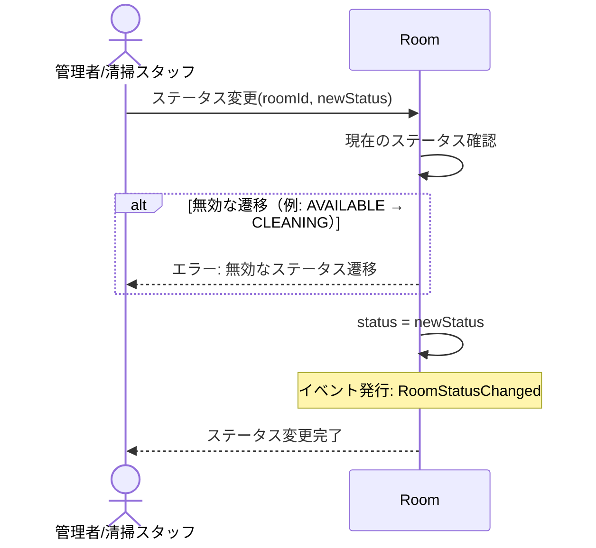

# DE-11: 部屋ステータス変更 (RoomStatusChanged)

## 概要
管理者（清掃スタッフ等）が部屋のステータスを変更した時点で発行される。主に清掃完了→空室への復帰や、メンテナンス設定に使用する。

## イベントペイロード
| フィールド | 型 | 説明 |
|-----------|---|------|
| roomId | RoomId | 対象の部屋 |
| hotelId | HotelId | 対象ホテル |
| roomNumber | RoomNumber | 部屋番号 |
| previousStatus | RoomStatus | 変更前のステータス |
| newStatus | RoomStatus | 変更後のステータス |
| changedAt | DateTime | 変更日時 |

## 詳細フロー



## 有効なステータス遷移
```
AVAILABLE → MAINTENANCE
OCCUPIED → CLEANING        ← チェックアウト時（DE-07経由）
CLEANING → AVAILABLE       ← 清掃完了（本イベントの主な用途）
CLEANING → MAINTENANCE
MAINTENANCE → AVAILABLE
```

## 後続処理
| 処理 | 担当 | 説明 |
|------|------|------|
| 在庫反映 | RoomType | CLEANING→AVAILABLEの場合、空室数が増加 |

## 関連イベント
- ← [DE-07: チェックアウト](./DE-07_guest-checked-out.md) — チェックアウト時にOCCUPIED→CLEANINGへ遷移
