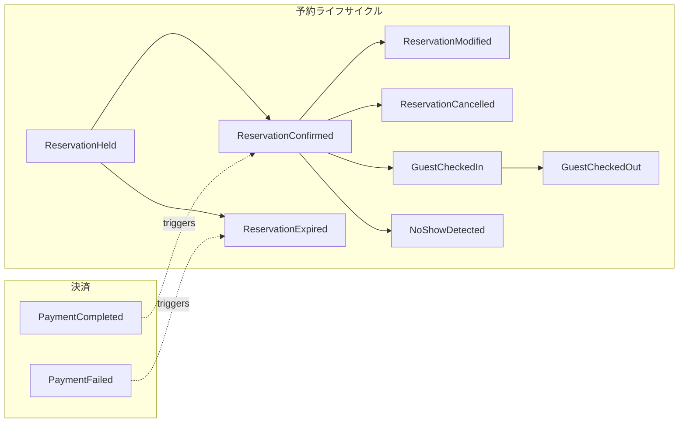
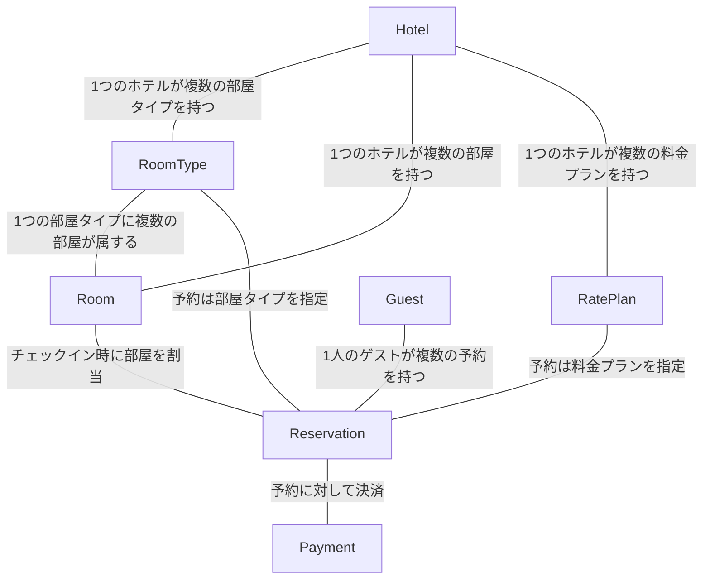

# ホテル予約システム ドメインモデル

## 集約一覧

| 集約 | 集約ルート | 責務 |
|------|-----------|------|
| Hotel | Hotel | ホテルの基本情報、チェックイン/アウト時刻、シーズン・料金係数・キャンセルポリシーの管理 |
| RoomType | RoomType | 部屋種別の定義。定員・基準人数・基本料金・人数調整額の管理 |
| Room | Room | 物理的な部屋の管理。部屋番号・ステータス |
| RatePlan | RatePlan | 料金プランの定義（素泊まり、朝食付き等） |
| Guest | Guest | ゲスト情報の管理 |
| Reservation | Reservation | 予約ライフサイクルの管理。仮予約〜チェックアウトまでの状態遷移と料金計算 |
| Payment | Payment | 決済処理の管理 |

## ドメインモデル図

```mermaid
classDiagram
    direction TB

    %% ========================================
    %% Hotel 集約
    %% ========================================
    namespace HotelAggregate {
        class Hotel {
            <<Aggregate Root>>
            +HotelId id
            +HotelName name
            +CheckInOutPolicy checkInOutPolicy
            +List~Season~ seasons
            +List~RateMultiplier~ rateMultipliers
            +CancellationPolicy cancellationPolicy
            +LengthOfStayDiscount lengthOfStayDiscount
            +findSeason(date: LocalDate) Season
            +getRateMultiplier(season: Season, dayType: DayType) RateMultiplier
            +calculateCancellationFee(totalAmount: Money, checkInDate: LocalDate, cancelDate: LocalDate) Money
        }

        class HotelName {
            <<Value Object>>
            +String value
        }

        class CheckInOutPolicy {
            <<Value Object>>
            +LocalTime checkInTime
            +LocalTime checkOutTime
        }

        class Season {
            <<Value Object>>
            +SeasonType type
            +LocalDate startDate
            +LocalDate endDate
            +contains(date: LocalDate) bool
        }

        class SeasonType {
            <<Enumeration>>
            OFF
            REGULAR
            HIGH
            PEAK
        }

        class DayType {
            <<Enumeration>>
            WEEKDAY
            FRIDAY
            SATURDAY_OR_HOLIDAY_EVE
        }

        class RateMultiplier {
            <<Value Object>>
            +SeasonType seasonType
            +DayType dayType
            +Decimal multiplier
        }

        class CancellationPolicy {
            <<Value Object>>
            +List~CancellationRule~ rules
            +calculateFeeRate(checkInDate: LocalDate, cancelDate: LocalDate) Decimal
        }

        class CancellationRule {
            <<Value Object>>
            +int daysBeforeCheckIn
            +Decimal feeRate
        }

        class LengthOfStayDiscount {
            <<Value Object>>
            +List~DiscountTier~ tiers
            +getDiscountRate(nights: int) Decimal
        }

        class DiscountTier {
            <<Value Object>>
            +int minNights
            +Decimal discountRate
        }
    }

    Hotel *-- HotelName
    Hotel *-- CheckInOutPolicy
    Hotel *-- "1..*" Season
    Hotel *-- "1..*" RateMultiplier
    Hotel *-- CancellationPolicy
    Hotel *-- LengthOfStayDiscount
    Season --> SeasonType
    RateMultiplier --> SeasonType
    RateMultiplier --> DayType
    CancellationPolicy *-- "1..*" CancellationRule
    LengthOfStayDiscount *-- "1..*" DiscountTier

    %% ========================================
    %% RoomType 集約
    %% ========================================
    namespace RoomTypeAggregate {
        class RoomType {
            <<Aggregate Root>>
            +RoomTypeId id
            +HotelId hotelId
            +RoomTypeName name
            +Occupancy occupancy
            +Money baseRate
            +List~OccupancyAdjustment~ occupancyAdjustments
            +calculateOccupancyAdjustment(guestCount: GuestCount) Money
        }

        class RoomTypeName {
            <<Value Object>>
            +String value
        }

        class Occupancy {
            <<Value Object>>
            +int standardCount
            +int maxCount
        }

        class OccupancyAdjustment {
            <<Value Object>>
            +int guestDelta
            +Money adjustmentAmount
        }
    }

    RoomType *-- RoomTypeName
    RoomType *-- Occupancy
    RoomType *-- "*" OccupancyAdjustment
    RoomType --> Hotel : hotelId

    %% ========================================
    %% Room 集約
    %% ========================================
    namespace RoomAggregate {
        class Room {
            <<Aggregate Root>>
            +RoomId id
            +HotelId hotelId
            +RoomTypeId roomTypeId
            +RoomNumber number
            +RoomStatus status
            +checkIn() void
            +checkOut() void
            +markCleaned() void
        }

        class RoomNumber {
            <<Value Object>>
            +String value
        }

        class RoomStatus {
            <<Enumeration>>
            AVAILABLE
            OCCUPIED
            CLEANING
            MAINTENANCE
        }
    }

    Room *-- RoomNumber
    Room --> RoomStatus
    Room --> RoomType : roomTypeId
    Room --> Hotel : hotelId

    %% ========================================
    %% RatePlan 集約
    %% ========================================
    namespace RatePlanAggregate {
        class RatePlan {
            <<Aggregate Root>>
            +RatePlanId id
            +HotelId hotelId
            +RatePlanName name
            +RatePlanType type
            +Money additionalChargePerPerson
        }

        class RatePlanName {
            <<Value Object>>
            +String value
        }

        class RatePlanType {
            <<Enumeration>>
            ROOM_ONLY
            WITH_BREAKFAST
            HALF_BOARD
        }
    }

    RatePlan *-- RatePlanName
    RatePlan --> RatePlanType
    RatePlan --> Hotel : hotelId

    %% ========================================
    %% Guest 集約
    %% ========================================
    namespace GuestAggregate {
        class Guest {
            <<Aggregate Root>>
            +GuestId id
            +GuestName name
            +ContactInfo contactInfo
        }

        class GuestName {
            <<Value Object>>
            +String firstName
            +String lastName
        }

        class ContactInfo {
            <<Value Object>>
            +Email email
            +PhoneNumber phoneNumber
        }
    }

    Guest *-- GuestName
    Guest *-- ContactInfo

    %% ========================================
    %% Reservation 集約
    %% ========================================
    namespace ReservationAggregate {
        class Reservation {
            <<Aggregate Root>>
            +ReservationId id
            +ReservationNumber number
            +HotelId hotelId
            +GuestId guestId
            +RoomTypeId roomTypeId
            +RatePlanId ratePlanId
            +RoomId assignedRoomId
            +StayPeriod stayPeriod
            +GuestCount guestCount
            +ReservationStatus status
            +List~DailyRate~ dailyRates
            +Money totalAmount
            +DateTime expiresAt
            +confirm(reservationNumber: ReservationNumber) void
            +modify(stayPeriod: StayPeriod, guestCount: GuestCount, roomTypeId: RoomTypeId, ratePlanId: RatePlanId) void
            +cancel() void
            +checkIn(roomId: RoomId) void
            +checkOut() void
            +expire() void
            +markNoShow() void
            +calculateTotalAmount() Money
        }

        class ReservationNumber {
            <<Value Object>>
            +String value
        }

        class StayPeriod {
            <<Value Object>>
            +LocalDate checkInDate
            +LocalDate checkOutDate
            +getNights() int
            +getStayDates() List~LocalDate~
        }

        class GuestCount {
            <<Value Object>>
            +int adults
            +int childSchoolAge
            +int childInfant
            +getTotalCount() int
        }

        class ReservationStatus {
            <<Enumeration>>
            HELD
            CONFIRMED
            CHECKED_IN
            CHECKED_OUT
            CANCELLED
            EXPIRED
            NO_SHOW
        }

        class DailyRate {
            <<Value Object>>
            +LocalDate date
            +Money baseAmount
            +Decimal rateMultiplier
            +Money occupancyAdjustment
            +Money planCharge
            +getSubtotal() Money
        }
    }

    Reservation *-- ReservationNumber
    Reservation *-- StayPeriod
    Reservation *-- GuestCount
    Reservation --> ReservationStatus
    Reservation *-- "1..*" DailyRate
    Reservation --> Hotel : hotelId
    Reservation --> Guest : guestId
    Reservation --> RoomType : roomTypeId
    Reservation --> RatePlan : ratePlanId
    Reservation --> Room : assignedRoomId

    %% ========================================
    %% Payment 集約
    %% ========================================
    namespace PaymentAggregate {
        class Payment {
            <<Aggregate Root>>
            +PaymentId id
            +ReservationId reservationId
            +Money amount
            +PaymentStatus status
            +PaymentMethod method
            +DateTime processedAt
            +process() void
            +refund(amount: Money) void
        }

        class PaymentStatus {
            <<Enumeration>>
            PENDING
            COMPLETED
            FAILED
            REFUNDED
        }

        class PaymentMethod {
            <<Enumeration>>
            CREDIT_CARD
            DEBIT_CARD
        }
    }

    Payment --> PaymentStatus
    Payment --> PaymentMethod
    Payment --> Reservation : reservationId

    %% ========================================
    %% 共有値オブジェクト
    %% ========================================
    namespace SharedKernel {
        class Money {
            <<Value Object>>
            +Decimal amount
            +Currency currency
            +add(other: Money) Money
            +subtract(other: Money) Money
            +multiply(factor: Decimal) Money
        }

        class Currency {
            <<Enumeration>>
            JPY
            USD
        }
    }

    Money --> Currency
```

## ドメインイベント

## 集約間の参照関係

